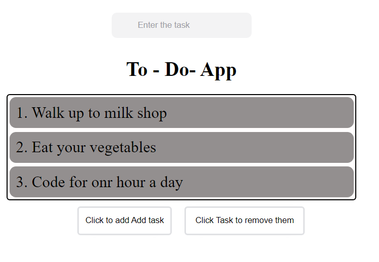

# To-Do App ✅

Welcome to the To-Do App! This is a simple and intuitive application built with HTML, CSS, and JavaScript that helps you manage your tasks efficiently. The app allows users to add, edit, and delete tasks, and keep track of their daily activities.

## Features ✨

- **Task Management** 🗒️: Add, edit, and delete tasks with ease.
- **Task Filtering** 🔍: Filter tasks by their status (completed or pending).
- **Responsive Design** 📱: Accessible and user-friendly on any device.

## Technologies Used 💻

- **HTML** 🏗️: The structure of the to-do app.
- **CSS** 🎨: Styling and layout for a clean and modern interface.
- **JavaScript** ⚙️: Adding functionality and interactivity to manage tasks.

## Installation 🔧

To get started with the To-Do App on your local machine, follow these steps:

 **Clone the Repository** 🚀:
   git clone https://github.com/Ancient100000/todo-app.git

**Preview of project :**

